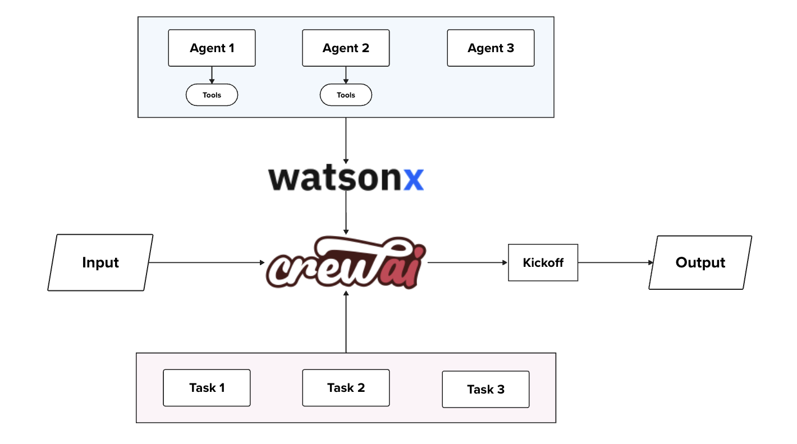

# Watsonx Multi Agent System with Crew AI

For this demo, all the dependencies can be installed within the notebook, and either the watsonx.ai or ollama can be used as to provide LLM base model.

## LLM Model with Ollama serve

### Ollama Set up

Find the available versions to download at [ollama.com](https://ollama.com/).

## LLM Model from watsonx.ai

### Watsonx Set up

Please, refer to [watsonx docs](https://cloud.ibm.com/docs/watsonxdata?topic=watsonxdata-getting-started) for instantiating and getting connection details. Note that also, a IAM key is needed to autenticate into the watsonx.ai APIs. Create your own API IAM key following the steps [in here](https://cloud.ibm.com/docs/account?topic=account-userapikey&interface=ui#userapikey).

## Links

- [Granite tool calling](https://www.ibm.com/think/tutorials/granite-function-calling)
- [Base Article](https://developer.ibm.com/blogs/awb-leveraging-crewai-and-ibm-watsonx/)